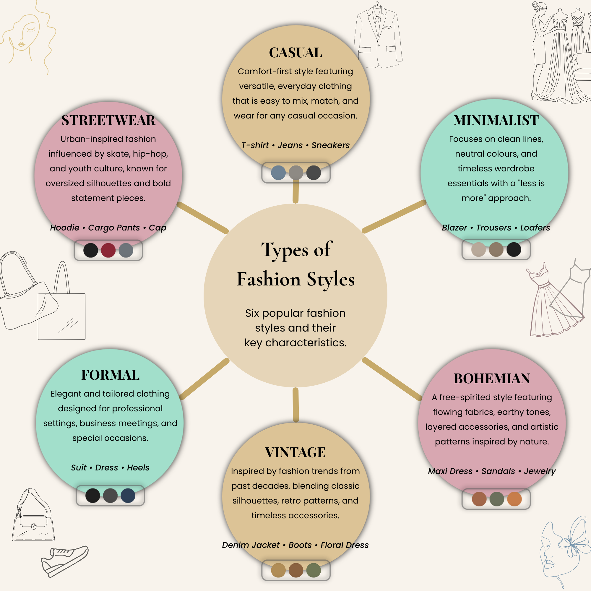

# Fashion Styles Infographic

  

  <em>Figure 1: Final Infographic Design</em>

## Overview

This project focused on designing an infographic that presents six popular fashion styles and their key characteristics in a visually engaging and easy-to-understand format. Infographics combine imagery, typography, color, and layout to communicate information effectively, transforming complex content into a clear and memorable visual experience.

The objective was to create an attractive and informative design that organizes fashion-related information in a structured manner while maintaining readability, visual hierarchy, and aesthetic appeal.

## Research & Planning

Before designing the infographic, research was conducted on different fashion styles, their defining characteristics, common clothing items, and visual identities. The information was then organized into concise content blocks to ensure clarity and quick comprehension.

The selected fashion styles include:

* Casual
* Minimalist
* Bohemian
* Vintage
* Formal
* Streetwear

## Design Process

1. Researched various fashion styles and identified their distinguishing characteristics.
2. Collected relevant content and categorized information into concise sections.
3. Planned the infographic structure using a radial layout to improve visual flow.
4. Developed a color palette that provides contrast while maintaining consistency across all categories.
5. Selected typography that balances readability and visual appeal.
6. Incorporated illustrations and decorative fashion-themed elements to enhance engagement.
7. Established a clear visual hierarchy using shapes, spacing, and alignment.
8. Refined the layout to ensure information remains organized and easy to scan.
9. Reviewed the infographic for consistency, readability, and overall visual impact.
10. Exported the final infographic for presentation and digital sharing.

---

## Tools Used

## Outcome

The final infographic successfully presents information about different fashion styles in a visually appealing and easily digestible format. Through this project, practical experience was gained in information design, visual hierarchy, typography, layout composition, color selection, and creating effective infographics that communicate content clearly and engagingly.

## Created By

**Isha Hanaan**

*Graphics Design Internship - Task 4*
